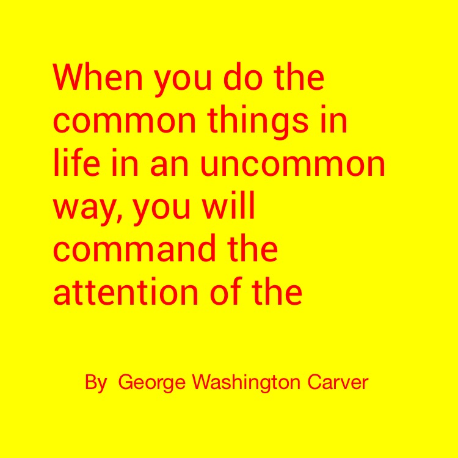
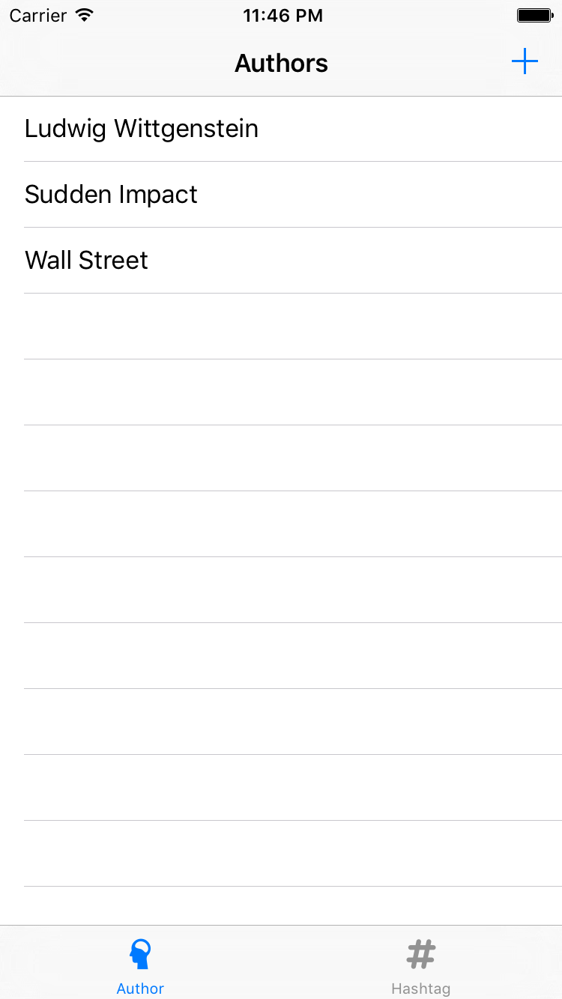
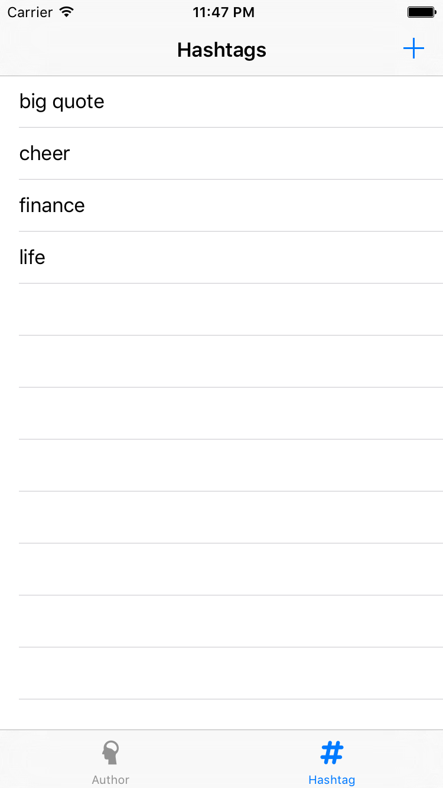
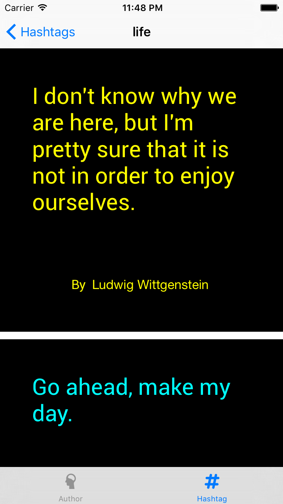
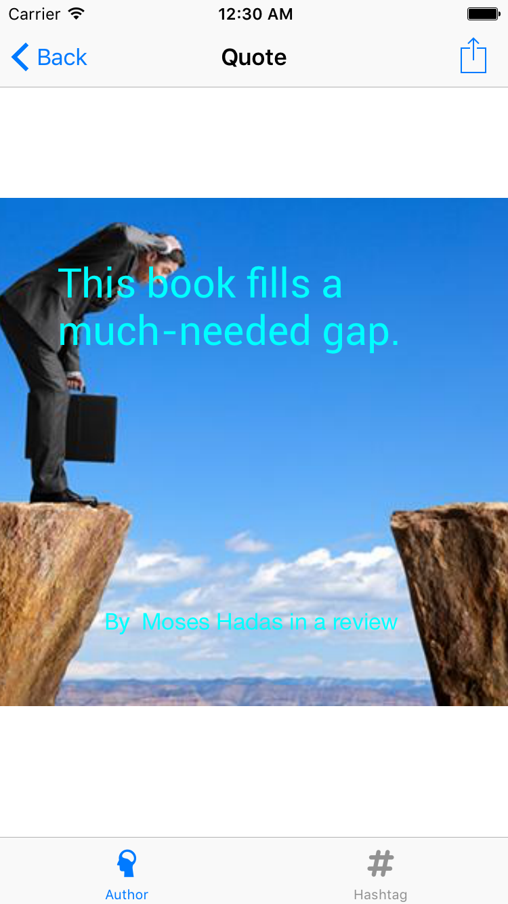
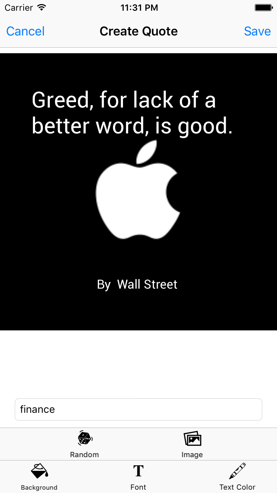
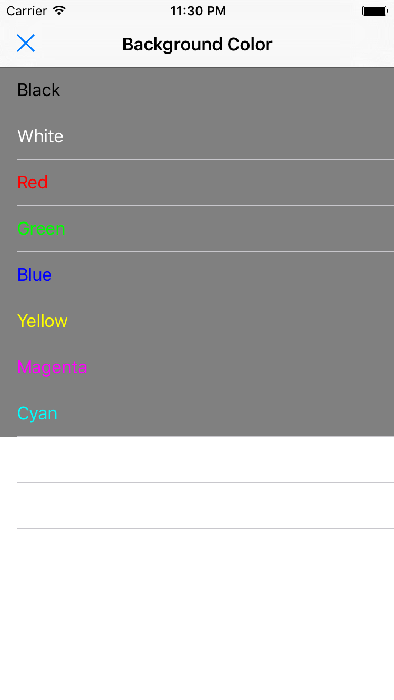
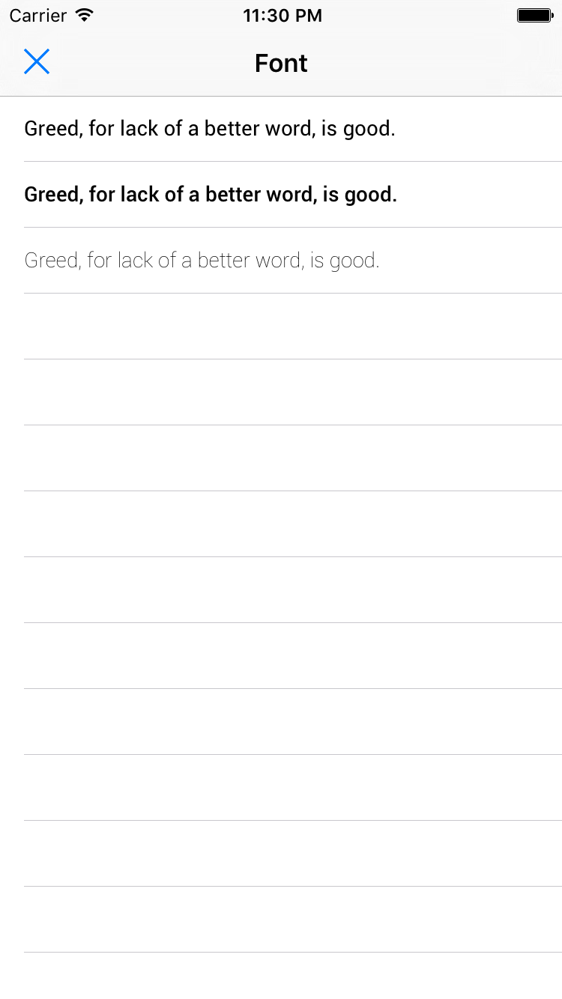

## Big Quote

### What is this?

It is a big quote generator.
Simply enter your favourite quote and the author name, pick your favourite style, and a new quote image is generated.
Here is an example:

### How to use?

#### Authors View
It lists all input quotes' authors. You can create new quote by tapping the `+` button.

#### Hashtags View
It lists all input quotes' hashtags. You can create new quote by tapping the `+` button.

#### Quotes List View
It lists the filtered quotes, which are filtered by author's name or hashtag.

#### Quote Detail View
It shows the selected quote.

#### Quote Generator View
It provides some different tools for you to generate quote.
Tap `Save` to save the edited quote, and `Cancel` to exit.
The style (font & color) you chose this time will be saved as the initial state next time.

* Quote View
	- It allows you to directly input the quote and author.
	- Tap outside the quote view to dismiss the keyboard while editing quote text view.
	- Tap `return` to dismiss the keyboard while editing author name.

* Hashtags Input Field
	- It allows you to enter the hashtags related to this quote. Multiple tags can use comma to separate.

* Random quote fetcher
	- It gets random quote using API from [andrux](https://market.mashape.com/andruxnet/random-famous-quotes)

* Image search
	- It allows you to select image from your album or search from web by using [Custom Search Engine](https://developers.google.com/custom-search/)

* Background color & Text color picker
	

* Font picker
	

### How to build?

1. Get marketplace API key from [mashape](https://market.mashape.com/andruxnet/random-famous-quotes) by registration.
1. Get Google API key from [Google Develpoer Console](https://console.developers.google.com/home/dashboard?project=api-project-174904668213&pli=1), [Reference](https://developers.google.com/identity/sign-in/web/devconsole-project)
1. Create custom search engine from [Google CSE](https://cse.google.com/manage/all), [Reference](https://developers.google.com/custom-search/docs/tutorial/creatingcse)
1. Please make sure image search is enabled in the search engine settings.
1. Replace the keys in `Config.swift.template` and rename it to `Config.swift`.
1. Build the project and enjoy the app. (iPhone 6 / 6s simulator is recommended.)

### Image Lisence

The icon images used in this app are downloaded from [thenounproject.com](https://thenounproject.com),
please *DO NOT* redistribute them.
